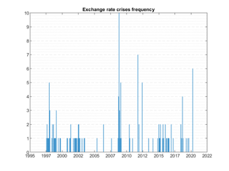
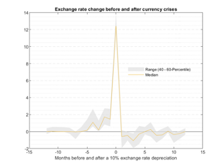
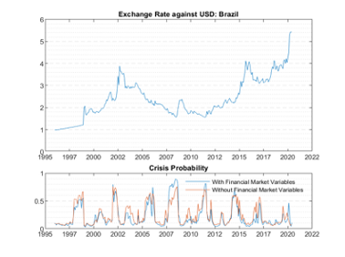
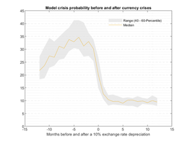
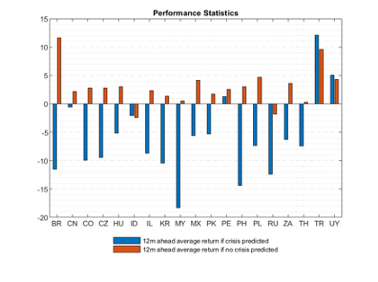
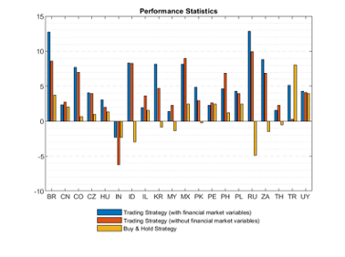
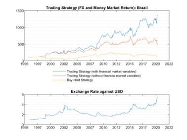
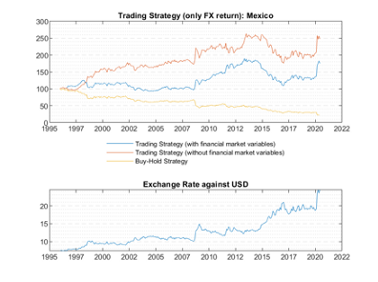

Currency crises are common in financial markets, and significant currency depreciations are one of the most telling indicators of how market participants view a country’s prospects. The COVID-19 pandemic was no different; investors sought flight to quality, which led several countries with weaker fundamentals experience steep currency depreciations. Out of 24 emerging markets, six underwent a month-on-month currency depreciation of more than 10% against the USD. While this demonstrates the economic severity of the COVID-19 crisis, the chart below shows that the 2008 financial crisis was in fact far worse.

## Foreign Exchange (FX) risk management concerns everybody

FX risk is an integral part of risk management. Export-oriented companies, who invoice in foreign currencies, are concerned about receiving payment. Similarly, bond or equity investors care about the value of their investments in their home currency, while policymakers have a keen interest in detecting vulnerabilities in the domestic market. An early warning system (EWS) for currency crises would, therefore, be valuable in signalling economic weaknesses, particularly for enabling policymakers to take appropriate actions to avert a crisis.

## It’s “good” to experience many currency crises
Because no perfect model exists, a wealth of academic and practical literature has emerged on econometric models for EWS going back decades. And as the chart above shows, we’ve encountered several currency crises in recent years.
Although each new currency crisis offers a valuable learning opportunity from the modeling perspective, the combined adverse effects of economic contraction, rising unemployment and soaring prices have proven to be destructive, especially to small economies.
That said, a broader set of crises improves quantitative modelling and opens the door to new approaches. Machine learning concepts benefit from more extensive data sets, and the results could be an essential tool to stakeholders including policymakers, central banks and investors in detecting looming vulnerabilities.

## CountryRisk.io’s Early Warning System

We at CountryRisk.io have spent the last year using the latest developments in machine learning to develop and test an EWS for 24 major emerging economies.
For modelling purposes, we define a currency crisis as a 10% nominal depreciation in the exchange rate relative to the US dollar. The academic literature contains similar definition, in addition to others based upon so-called exchange market pressure (EMP) indices that account for changes to a country’s exchange rates and FX reserves. The EMP crisis definition is of particular interest to policymakers who want to cover both successful and unsuccessful exchange rate “attacks”. Since we want an early warning signal, we aim to predict not the actual crisis period but the 12 months leading up to it.
The chart below shows how exchange rates tend to behave around currency crises. Typically, the currency gradually weakens ahead of the crisis period (t = 0) and recovers once the crisis has passed.

Once the crisis definition has been determined, we must decide on a modelling strategy. Standard econometric approaches typically relied on a single model, such as logit model or signalling approach pioneered by Kaminsky, Goldstein and Reinhart. After trying different specifications and functional forms, such approaches would arrive at a single “best” model that they’d use to predict crises.
Innovations in econometric modelling have ushered in new approaches from which we benefit. Nowadays, we use machine learning strategies together with classic econometric techniques, along with information from many different modelling strategies, to try to predict a currency crisis.
The idea is to take the average prediction of several conceptually different models as an overall prediction of a crisis. Specifically, we’re using a Voting Classifier algorithm to get the average prediction of three different models: a logit model (the standard choice in the econometrics literature), an XGBOOST (most used decision tree ensemble) and a Long-Short Term Memory (LSTM) neural network.
To avoid overfitting, we split our data into separate training and test datasets. In statistical learning, it’s important that the model “learns” about the systematic information of the explanatory variables. Due to the time dependency intrinsic in our data, we’ve adopted a “Time Series Split” strategy. This splitting strategy is crucial because the use of cross-validation in the presence of time-dependency can lead to overfitted results that will give false signals regarding currency crises.
We selected the explanatory indicators based on the characteristics of previous currency crises (e.g. FX reserves changes) and the academic literature on factors that affect the exchange rate. We’re also working on a second version of the model that includes proxy variables for global risk appetite (e.g. VIX).
The topmost chart below shows the exchange rate of the Brazilian real against the USD. Since 1995, the currency has lost substantial value. However, there have also been long stretches, such as 2002–2007, in which the currency appreciated against the USD. The lower chart shows the estimated crisis probabilities for both model specifications.

Comparing the two charts suggests that the model offers a heads-up before periods of currency weakness, with both model specifications giving broadly similar results. However, while the model with financial market variables such as VIX showed an elevated crisis probability in advance of the COVID-19 pandemic, the specification without financial market variables did not. This indicates that there’s value in including financial market variables in the model, since this allows the EWS to capture not only domestic crises driven by weaker fundamentals but also currency crises that follow a pullback of global risk appetite. Nevertheless, financial market indicators are only useful if they give an early warning signal — concurrent signals are of no value.
Aggregating the signals across all countries and crisis periods, as illustrated in the chart below, reveals that the model does a good job in predicting currency crises: the probability tends to increase in the months ahead of the currency depreciation and fall sharply right after the crisis.

## Can we use the model?
To assess the usefulness of our model, we first calculated the total returns (i.e. FX change and interest rate return) for the next 12 months for countries for which the model signalled a crisis and compared them with those of countries for which it predicted a tranquil period.

We found that the model offered high differentiation between crisis and tranquil periods for most of the countries we examined. Where the model predicted a crisis, the 12-month returns were usually profoundly negative, while those following predictions of tranquillity tended to be positive. The obvious outliers were Indonesia, Turkey and, to a smaller extent, Uruguay.
We also calculated the performance of a simple trading strategy. In a nutshell, we invested in the emerging market’s currency where the model signalled a low crisis probability. Where the model indicated a crisis probability above 20%, we went short on that currency and long on the USD. Under normal circumstances, as developing countries typically pay higher interest rates, a short position against its currency has a high cost. For such a strategy to work then, the model needed to be good enough to predict significant currency depreciations. We used a one-month implementation delay, and we accounted for the interest rate differential between the emerging economy and the US in assessing the strategy’s performance. The benchmark for comparison was a simple buy-and-hold investment strategy.
Both model specifications significantly outperformed the buy-and-hold strategy, although the specification with financial market variables performed even better than the one without such indicators. The chart below summarises the results.

The charts below show the individual trading strategies for Brazil and Mexico.

## Outlook
As we have seen, advances in machine learning have given us new tools to model currency crises that can produce useful early warning signals. Given the positive results of our EWS, we will integrate it into a future update of the CountryRisk.io Insights Platform to help our users make better country risk decisions. Over time, we aim to include more countries in the EWS and improve it by adding other relevant indicators and applying new methodologies as the academic literature evolves.
For additional model results and methodology, and if you want to learn more about CountryRisk.io and our analytics, please email contact@countryrisk.io. We’d love to hear from you.
This article and the presented model was developed jointly by Bernhard Obenhuber, Vitor Pestana and Leonardo Frota.
Vitor has experience in the public sector, where he worked in regional development and international investment attraction. He has a master’s degree in Economics from the Federal University of Paraná and is currently a PhD candidate at the same institution.
Leonardo is a Professor of Finance and Economics at the Catholic University of Paraná. He is currently a PhD candidate in Development Economics at the Federal University of Paraná. His current research projects focus on the intersection of Machine Learning and Applied Economics. Leonardo has also implemented projects in the area of credit risk modelling for the private sector.