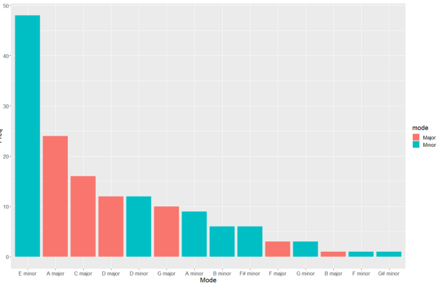
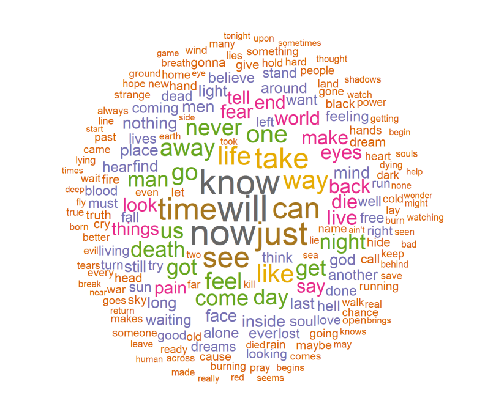

Inspired by [Evan Oppenheimer’s article](https://medium.com/@evanopp), which seeks, through data analysis, to find the most violent song of Death Grips, I decided to get together two of the things I most like: data analysis and Iron Maiden.
The data from each song is obtained through Spotifyr, an R package created by Charlie Thompson¹, which allows large-scale extraction from Spotify API data. The information available is the most diverse, from the duration and the key, to a variable called “valence”, which, according to the source, measures the “musical positivity” of each recording.
Unlike Evan, the analysis here will be more exploratory than objective. I will show just a few curiosities found in the data of the 152 songs from the 16 studio albums. It should be noted that only the songs that were on the discs originally are included in the analysis. Therefore, there is no Sanctuary on the first record or Total Eclipse in The Number of the Beast album.
Looking at the data, the first idea that occurred to me was the issue of the tonality of the songs. There is a general view that most of Iron Maiden´s songs are in E minor, as well as most of the other metal bands. We were not wrong:

For those who do not understand much the difference between the major and minor keys, the best way to learn is by listening to both. The youtube channel Happy Metal, change metal songs from minor to major keys (Hallowed be thy name, for example), making them “happy”.
The E minor is the most frequent key on Iron Maiden tracks, but something is strange: the amount of music in the major key. It’s not that there are no metal songs in this tonality, such as The Number of the Beast itself, for example, but it’s far less common.
Several songs that the database identifies as being a major key are, in fact, minor, such as Wrathchild, El Dorado and Hallowed be thy name. That shows us what the tone detection algorithm does not work perfectly. Here comes a lesson: you often have to be wary of the data.
The data also brings a variable that measures, from 0 to 100, the popularity of the songs. The chart below shows the popularity of each one, according to the year the album was released.

<iframe width="900" height="800" frameborder="0" scrolling="no" src="//plotly.com/~Vitorpestana/5.embed"></iframe>

Immediately we can notice the discrepancy of the album The Final Frontier, from 2010, with the rest of the discography. It’s not the most loved album of the fans, but would it be less popular than both of Blaze’s era albums? That seems somehow wrong. Maybe it was stuffy by the release of The Book of Souls, the first album recorded in the times of Spotify. On the other side, Iron Maiden’s most heard songs are not surprising, in order: The Trooper, Run to the Hills, and Fear of the Dark.
Continuing an analysis, we will use the valence and energy measures. Spotify defines valence:

> “ A measure from 0.0 to 1.0 describing the musical positiveness conveyed by a track. Tracks with high valence sound more positive (e.g. happy, cheerful, euphoric), while tracks with low valence sound more negative (e.g. sad, depressed, angry).”

And energy:

> "“Energy is a measure from 0.0 to 1.0 and represents a perceptual measure of intensity and activity. Typically, energetic tracks feel fast, loud, and noisy. For example, death metal has high energy, while a Bach prelude scores low on the scale. Perceptual features contributing to this attribute include dynamic range, perceived loudness, timbre, onset rate, and general entropy.”

By taking these variables on a timeline, we can observe a curious pattern throughout the band’s albums. Energy is represented by the color of each observation.

<iframe width="900" height="800" frameborder="0" scrolling="no" src="//plotly.com/~Vitorpestana/7.embed"></iframe>

There is a sonority before the departure of Bruce Dickinson in 1994, and one after. The difference in the two variables is quite significant. Not surprisingly, the album X-Factor is the album with the lower average in both indicators, since it is a disc very influenced by the bad moment that Steve Harris, leader of the band, was passing in his personal life. To get an idea, of the five songs with less “energy” of the band, four are from this album. Below, the table shows the five songs with more and less valence and energy, respectively.

Top 5 and Bottom 5 on Valence:

| Order      | Song                         | Valence | Album         |
|------------|------------------------------|---------|------------------------------|
| 1          | Wrathchild                   | 0.7820  | Killers
| 2          | Running free                 | 0.7640  | Iron maiden                  |
| 3          | Weekend warrior              | 0.7590  | Fear of the dark             |
| 4          | Aces high                    | 0.7560  | Powerslave                   |
| 5          | Futureal                     | 0.7060  | Virtual xi                   |
| 148        | Sign of the cross            | 0.1110  | The x-factor                 |
| 149        | Seventh son of a seventh son | 0.0948  | Seventh son of a seventh son |
| 150        | The great unknown            | 0.0702  | The book of souls            |
| 151        | Isle of avalon               | 0.0650  | The final frontier           |
| 152        | Lord of light                | 0.0485  | A matter of life and death   |

Top 5 and Bottom 5 on Energy:

| Order | Song                                       | Energy | Album             |
|-------|--------------------------------------------|--------|-------------------|
| 1     | The loneliness of the long distance runner | 0.991  | Somewhere in time |
| 2     | Montségur                                  | 0.990  | Dance of death    |
| 3     | Futureal                                   | 0.990  | Virtual xi        |
| 4     | Iron maiden                                | 0.988  | Iron maiden       |
| 5     | Caught somewhere in time                   | 0.987  | Somewhere in time |
| 148   | The aftermath                              | 0.627  | The x-factor      |
| 149   | Fortunes of war                            | 0.561  | The x-factor      |
| 150   | Strange world                              | 0.538  | Iron maiden       |
| 151   | Look for the truth                         | 0.506  | The x-factor      |
| 152   | 2 a.m.                                     | 0.483  | The x-factor      |

At another time, the lyrics of the songs could even be the object of a separate analysis. With the wordcloud package I built a cloud of words with the lyrics of all the 152 songs. The result shows the 200 most recurring words, which say a lot about the most recurring themes and the introspective feeling present in most of them.

Much more can be exploited with this data and the Spotify API. For those who use R, spotifyr makes it much easier to get information. For today, I leave you with the recording with the greatest “danceability” of Iron Maiden, believe it or not.

<iframe width="901" height="676" src="https://www.youtube.com/embed/oAlC163AXeU" title="YouTube video player" frameborder="0" allow="accelerometer; autoplay; clipboard-write; encrypted-media; gyroscope; picture-in-picture" allowfullscreen></iframe>

[1] I thank Charlie and Evan for helping me out with an error that was occurring in R. Because of this error, the code became more confusing than normal.